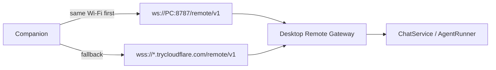

# Anya Companion

<p align="center"><strong>The Android remote for desktop Anya.</strong></p>

<p align="center">
  Scan a QR code on your PC, then chat, approve tools, and share files from your phone.<br />
  The Agent still runs on the desktop — this app is a remote console, not a second runtime.
</p>

<p align="center">
  <a href="./README.md">English</a>
  &nbsp;·&nbsp;
  <a href="./README.zh-CN.md">简体中文</a>
</p>

<p align="center">
  
  
  
</p>

<p align="center">
  Desktop: <a href="https://github.com/rururunu/Anya">rururunu/Anya</a>
  &nbsp;·&nbsp;
  This repo: <a href="https://github.com/rururunu/AnyaAndroid">rururunu/AnyaAndroid</a>
</p>

---

## At a glance

|                    |                                                                                          |
| ------------------ | ---------------------------------------------------------------------------------------- |
| **Pair**           | Scan the desktop “Connect phone” QR, or paste host / token. Deep link: `anya://pair`.    |
| **Chat**           | Same sessions as the PC: send, stream replies, cancel, switch Ask / Agent / Plan.        |
| **Approvals**      | Tool allow-once / session / deny, plus `ask_user` and plan cards.                        |
| **Files**          | Attach from the phone (chunked upload, up to 500MB). Tap a desktop offer to download.    |
| **Reachability**   | Same Wi-Fi uses LAN `ws://`. Away from home, Cloudflare Tunnel `wss://`.                 |

**Docs:** [Architecture](./docs/ARCHITECTURE.md) · [Releases](./docs/release.md) · [Changelog](./CHANGELOG.md) · [Index](./docs/README.md)

Desktop must be running with Remote Gateway enabled. Companion never talks to model providers itself.

---

## Pair and connect

1. Install and open [Anya](https://github.com/rururunu/Anya) on Windows.
2. Open **Connect phone** and wait until the QR shows a LAN address and, if you enabled it, a public tunnel host.
3. On the phone, scan the code (or enter host / port / token) and give the host a short name.
4. After `hello.ok`, chats, approvals, and workspace cards stay in sync with the desktop.

If the handshake takes more than five seconds, **Cancel connection** appears on the boot screen and takes you to connection settings — reconnect, switch a saved host, or re-pair one whose tunnel URL went stale. Quick Tunnel hostnames change when the desktop restarts; re-scan that host if the public URL went stale.



---

## What you can do

After pairing, **Ask** is not a second inbox on the phone — it is a live projection of the desktop ChatService. Threads you start, finish, or leave waiting on the PC show up as cards here. A yellow **Pending approval** badge means the Agent on the computer has already stopped and is waiting for a tap, on either device. The + button opens a new unbound session in desktop SQLite; both screens see it at once.

<p align="center">
  
</p>

**Workspace** groups those same threads by the folders on the PC. Names like `AnyaAndroid` come from desktop workspaces, not from local storage. Opening one continues that run on the computer; the file catalog, skills, and MCP lists are snapshots the phone asks the gateway for.

<p align="center">
  
</p>

Type on the phone and `chat.send` goes to the PC. **AgentRunner** on the desktop calls the model and tools; tokens stream back as `event` frames, so the typing you see is the computer generating. When the Agent uses `share_to_companion`, the thread only gets a card — the file stays on disk until you tap, then the phone pulls 512KB slices so one huge Base64 frame cannot blow up the device.

<p align="center">
  
</p>

When the Agent needs a preference, it calls `ask_user` on the desktop and pauses the run. The same question card appears on the phone. Pick an option (or type your own); `ask.respond` unblocks AgentRunner and the PC continues. The desktop window shows the same card.

<p align="center">
  
</p>

Anything that touches the machine — `run_shell`, writing a file on the desktop — is gated on the PC. Companion only shows the gate: allow once, remember for this session, or deny. `approval.respond` resumes the desktop Agent. Tapping the same card on Windows does the same thing; there is one latch, two screens.

<p align="center">
  
</p>

You will not always be staring at the thread. While the desktop Agent is blocked, the same item lands in **Inbox → Pending**. The red dot is an event from the PC, not a local reminder. Open the card, jump back into that session, and release the latch so the computer can keep working.

<p align="center">
  
</p>

Files the Agent finds on the PC are not dumped onto the phone. **Inbox → Results** is the `share_to_companion` list: **Not received** still lives on the computer; tap to pull slices. **Saved** is the local copy. The other way: phone attachments go up in chunks (max 500MB) and land under the workspace `.anya/uploads/{sessionId}/` (or the Ask inbox). Local web-app previews use `/p/{id}/` on the same gateway.

<p align="center">
  
</p>

**Settings** picks which Anya.exe you are talking to: host list, reconnect, re-pair when a Quick Tunnel hostname rotated, unpair, language, and in-app updates. Model API keys never leave the PC.

---

## Install

1. Build a debug APK (below) or install a release from this repo’s Releases when published.
2. Pair with a running desktop Anya as above.
3. Keep the phone on the same Wi-Fi as the PC when you can — it is more stable than a Quick Tunnel, especially in China.

Minimum: **Android 8.0 (API 26)**. Camera is optional (manual pairing still works).

---

## Run from source

Android Studio (recommended) or:

```bat
gradlew.bat :app:assembleDebug
```

Point `local.properties` `sdk.dir` at your Android SDK (`local.properties.example` is a template). Debug package id is `ai.anya.companion.debug`.

| Toolchain                         | Version        |
| --------------------------------- | -------------- |
| AGP / Gradle / Kotlin             | 9.0 / 9.1 / 2.2 |
| compileSdk / minSdk / targetSdk   | 36 / 26 / 36   |
| JDK for Android compile           | 17             |

Gradle 9.1+ is required if the host JDK is 25.

---

## Architecture (summary)

```text
app → feature:* → domain ← data
                 ↘ model / common / designsystem
data → network → OkHttp WebSocket → Desktop /remote/v1
```

The Agent, tools, SQLite, and model keys stay on the PC. Companion projects `event` frames (chat deltas, approvals, file offers) and sends RPCs (`chat.send`, `approval.respond`, `file.upload.*`, …). Each screen maps to that contract in [Architecture](./docs/ARCHITECTURE.md#surfaces).

---

## Privacy

Pairing credentials stay in DataStore on the device. Chat content and files travel only to the paired desktop over the gateway (LAN or your Cloudflare tunnel). Companion does not hold provider API keys.
