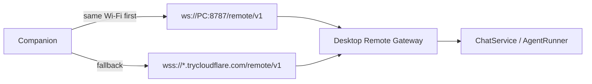

# Anya Companion

<p align="center"><strong>The Android remote for desktop Anya.</strong></p>

<p align="center">
  Scan a QR code on your PC, then chat, approve tools, and share files from your phone.<br />
  The Agent still runs on the desktop — this app is a remote console, not a second runtime.
</p>

<p align="center">
  <a href="./README.md">English</a>
  &nbsp;·&nbsp;
  <a href="./README.zh-CN.md">简体中文</a>
</p>

<p align="center">
  
  
  
</p>

<p align="center">
  Desktop: <a href="https://github.com/rururunu/Anya">rururunu/Anya</a>
  &nbsp;·&nbsp;
  This repo: <a href="https://github.com/rururunu/AnyaAndroid">rururunu/AnyaAndroid</a>
</p>

---

## At a glance

|                    |                                                                                          |
| ------------------ | ---------------------------------------------------------------------------------------- |
| **Pair**           | Scan the desktop “Connect phone” QR, or paste host / token. Deep link: `anya://pair`.    |
| **Chat**           | Same sessions as the PC: send, stream replies, cancel, switch Ask / Agent / Plan.        |
| **Approvals**      | Tool allow-once / session / deny, plus `ask_user` and plan cards.                        |
| **Files**          | Attach from the phone (chunked upload, up to 500MB). Tap a desktop offer to download.    |
| **Reachability**   | Same Wi-Fi uses LAN `ws://`. Away from home, Cloudflare Tunnel `wss://`.                 |

**Docs:** [Architecture](./docs/ARCHITECTURE.md) · [Releases](./docs/release.md) · [Changelog](./CHANGELOG.md) · [Index](./docs/README.md)

Desktop must be running with Remote Gateway enabled. Companion never talks to model providers itself.

---

## Pair and connect

1. Install and open [Anya](https://github.com/rururunu/Anya) on Windows.
2. Open **Connect phone** and wait until the QR shows a LAN address and, if you enabled it, a public tunnel host.
3. On the phone, scan the code (or enter host / port / token).
4. After `hello.ok`, chats, approvals, and workspace cards stay in sync with the desktop.

If the handshake takes more than five seconds, **Cancel connection** appears on the boot screen and takes you to connection settings — reconnect, or unpair and scan again. Quick Tunnel hostnames change when the desktop restarts; re-scan if the public URL went stale.



---

## What you can do

| Surface        | Role                                                                                      |
| -------------- | ----------------------------------------------------------------------------------------- |
| **Ask**        | Quick chats not bound to a workspace.                                                     |
| **Workspace**  | Project-bound sessions, file catalog, skills / MCP lists.                                 |
| **Inbox**      | Pending tool approvals and questions.                                                     |
| **Settings**   | Connection status, reconnect / unpair, language, in-app updates.                          |

Files from the phone land under the workspace `.anya/uploads/{sessionId}/` (or the Ask inbox). Desktop `share_to_companion` shows a card; bytes are pulled in 512KB slices so a large Base64 frame cannot blow up the phone. Previews of local web apps go through `/p/{id}/` on the same gateway.

---

## Install

1. Build a debug APK (below) or install a release from this repo’s Releases when published.
2. Pair with a running desktop Anya as above.
3. Keep the phone on the same Wi-Fi as the PC when you can — it is more stable than a Quick Tunnel, especially in China.

Minimum: **Android 8.0 (API 26)**. Camera is optional (manual pairing still works).

---

## Run from source

Android Studio (recommended) or:

```bat
gradlew.bat :app:assembleDebug
```

Point `local.properties` `sdk.dir` at your Android SDK (`local.properties.example` is a template). Debug package id is `ai.anya.companion.debug`.

| Toolchain                         | Version        |
| --------------------------------- | -------------- |
| AGP / Gradle / Kotlin             | 9.0 / 9.1 / 2.2 |
| compileSdk / minSdk / targetSdk   | 36 / 26 / 36   |
| JDK for Android compile           | 17             |

Gradle 9.1+ is required if the host JDK is 25.

---

## Architecture (summary)

```text
app → feature:* → domain ← data
                 ↘ model / common / designsystem
data → network → OkHttp WebSocket → Desktop /remote/v1
```

The Agent, tools, SQLite, and model keys stay on the PC. Companion projects `event` frames (chat deltas, approvals, file offers) and sends RPCs (`chat.send`, `approval.respond`, `file.upload.*`, …).

Full diagrams: [Architecture](./docs/ARCHITECTURE.md).

---

## Privacy

Pairing credentials stay in DataStore on the device. Chat content and files travel only to the paired desktop over the gateway (LAN or your Cloudflare tunnel). Companion does not hold provider API keys.
