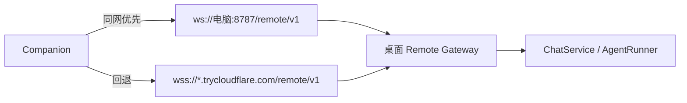
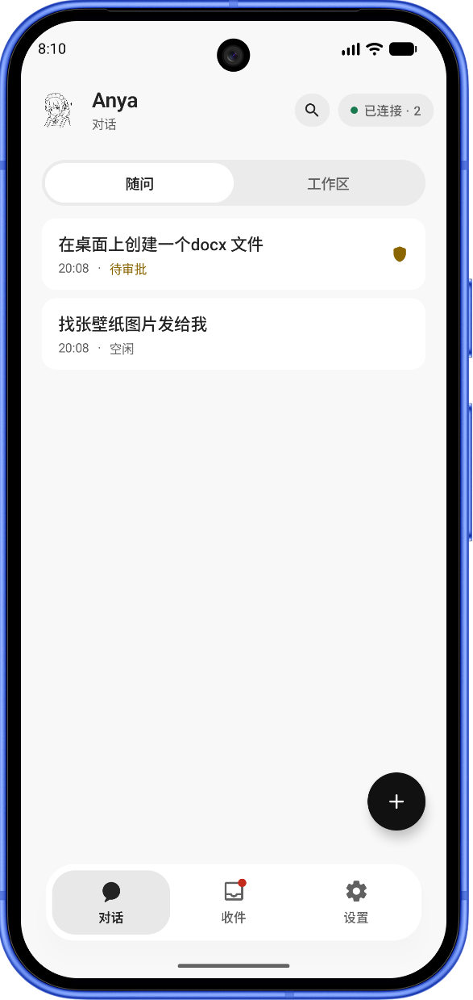
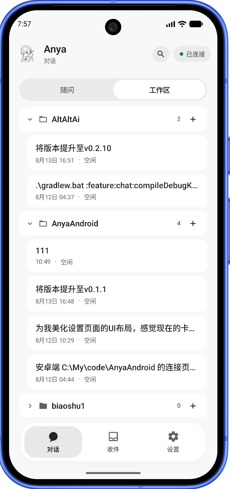
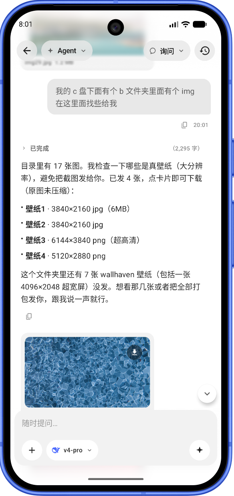
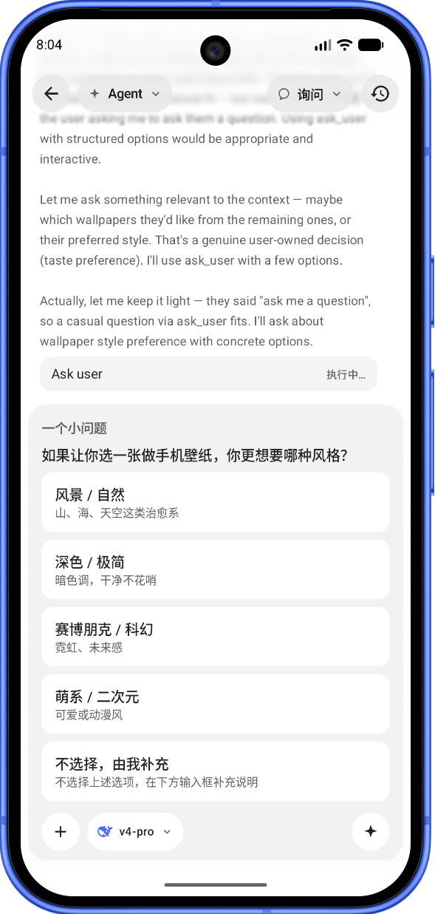
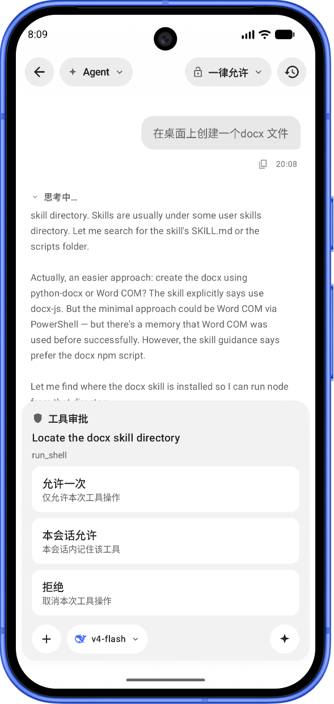
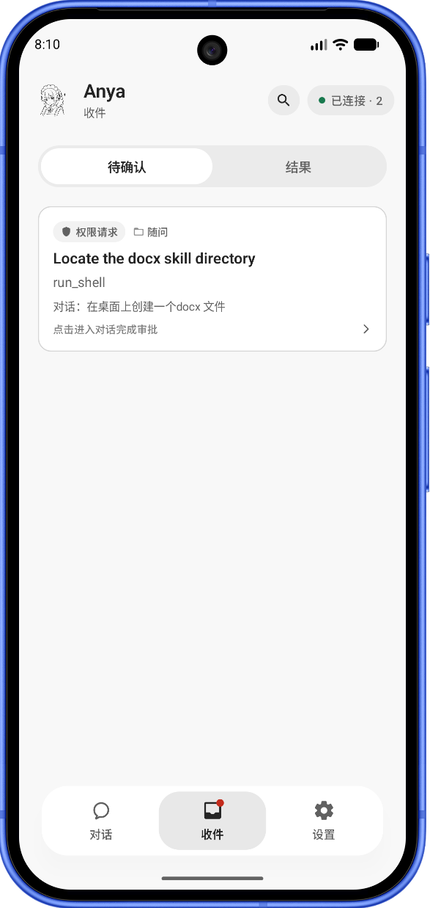
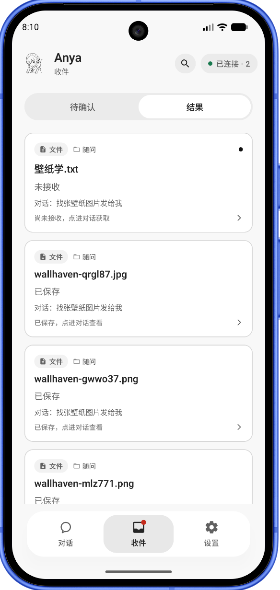

# Anya Companion

<p align="center">
  
</p>

<h1 align="center">Anya Companion</h1>

<p align="center"><strong>桌面 Anya 的安卓远程控制台。</strong></p>

<p align="center">
  扫电脑上的二维码，即可在手机上对话、审批工具、收发文件。<br />
  Agent 仍在桌面运行——本应用是遥控台，不是第二套运行时。
</p>

<p align="center">
  <a href="./README.md">English</a>
  &nbsp;·&nbsp;
  <a href="./README.zh-CN.md">简体中文</a>
</p>

<p align="center">
  
  
  
</p>

<p align="center">
  桌面端：<a href="https://github.com/rururunu/Anya">rururunu/Anya</a>
  &nbsp;·&nbsp;
  本仓库：<a href="https://github.com/rururunu/AnyaAndroid">rururunu/AnyaAndroid</a>
</p>

---

## 一览

|              |                                                                                          |
| ------------ | ---------------------------------------------------------------------------------------- |
| **配对**     | 扫描桌面「连接手机」二维码，或手动填写主机 / 令牌。深度链接：`anya://pair`。             |
| **对话**     | 与电脑同一批会话：发送、流式回复、取消，切换 Ask / Agent / Plan。                        |
| **审批**     | 工具允许一次 / 本会话 / 拒绝，以及 `ask_user` 与计划批准卡。                             |
| **文件**     | 手机附件分片上传（上限 500MB）；点桌面分享卡片分片下载。                                 |
| **可达性**   | 同一 Wi-Fi 走局域网 `ws://`；外出走 Cloudflare 隧道 `wss://`。                           |

**文档：** [架构](./docs/ARCHITECTURE.zh-CN.md) · [发布](./docs/release.zh-CN.md) · [更新日志](./CHANGELOG.zh-CN.md) · [索引](./docs/README.zh-CN.md)

桌面必须已开启 Remote Gateway。Companion **不会**自己去调模型服务商。

---

## 配对与连接

1. 在 Windows 上安装并打开 [Anya](https://github.com/rururunu/Anya)。
2. 打开 **连接手机**，等到二维码出现局域网地址（若已开启公网隧道，还会有公网主机名）。
3. 手机扫码（或填写主机 / 端口 / 令牌），并为这台主机起一个短名称。
4. `hello.ok` 之后，对话、审批与工作区卡片与桌面保持同步。

握手超过五秒，启动页会出现 **取消连接**，进入连接设置——可重连，切换已保存的主机，或对隧道域名失效的主机重新配对。Quick Tunnel 域名在桌面重启后会变；公网地址失效时请对该主机重新扫码。



---

## 能做什么

配对完成后，手机上的 **随问** 不是另一份聊天记录，而是电脑 ChatService 里那批「不绑项目」会话的投影。你在桌面新建、跑完、或卡住的线程，都会以卡片出现在这里。黄标 **待审批** 表示电脑上的 Agent 已经停住，在等手机或电脑点一下。右下角加号会在桌面 SQLite 再开一条随问会话，两边立刻能看到。

<p align="center">
  
</p>

**工作区** 按电脑上的项目文件夹分组。`AnyaAndroid` 这类名字来自桌面工作区，不是手机本地的。点进去续的是那台电脑上的线程；文件目录、Skills、MCP 列表也是向网关要来的快照。

<p align="center">
  
</p>

在手机上打字，真正发出去的是 `chat.send`：调模型、跑工具的是电脑上的 **AgentRunner**。回复以 `event` 增量推回来，你看到的逐字生成发生在电脑上。Agent 若用 `share_to_companion` 把壁纸交给你，线程里只多一张卡片——文件仍在电脑磁盘，点卡片才按 512KB 从网关拉下来，避免一条巨大 Base64 打爆手机。

<p align="center">
  
</p>

Agent 需要你拍板时，会在桌面调用 `ask_user` 并暂停整条 run。同一张选项卡出现在手机上；你点一项或自己补充，`ask.respond` 解冻电脑上的 Agent，它才继续往下跑。电脑窗口里是同一张问询。

<p align="center">
  
</p>

一旦要动电脑——`run_shell`、往桌面写文件——桌面会把这次工具调用挂起。手机只展示这道闸门：允许一次、本会话记住、或拒绝。`approval.respond` 之后，电脑上的 Agent 才继续。你在 Windows 上点同一张卡效果相同，闸门只有一道。

<p align="center">
  
</p>

人不可能一直盯着对话。桌面 Agent 卡住时，同一条待办会进 **收件 → 待确认**。红点来自电脑推过来的事件，不是手机自己记的。点卡片跳回那条会话，把闸门打开，电脑才会继续干活。

<p align="center">
  
</p>

Agent 在电脑上找到的文件，不会一次性灌进手机。**收件 → 结果** 是桌面 `share_to_companion` 的清单：**未接收** 的还在电脑磁盘上，点按后分片拉取；**已保存** 的才是本机副本。反过来，手机附件经分片上传（上限 500MB）落到工作区 `.anya/uploads/{sessionId}/`（随问则进 Ask 收件箱）。本地网页预览走同一网关上的 `/p/{id}/`。

<p align="center">
  
</p>

**设置** 决定连哪一台 Anya.exe：多主机切换、重连、隧道域名失效后重新扫码、解除配对，以及语言和应用内更新。模型 API Key 始终只在电脑上。

---

## 安装

1. 按下方构建 debug APK，或在本仓库 Releases 发布后安装正式包。
2. 按上文与正在运行的桌面 Anya 配对。
3. 尽量与电脑同一 Wi-Fi——比 Quick Tunnel 稳定，国内尤其如此。

最低 **Android 8.0（API 26）**。相机可选（仍可手动填写配对）。

---

## 从源码运行

推荐用 **Android Studio** 打开本目录，或：

```bat
gradlew.bat :app:assembleDebug
```

在 `local.properties` 中设置 `sdk.dir`（可参考 `local.properties.example`）。Debug 包名为 `ai.anya.companion.debug`。

| 工具链                            | 版本           |
| --------------------------------- | -------------- |
| AGP / Gradle / Kotlin             | 9.0 / 9.1 / 2.2 |
| compileSdk / minSdk / targetSdk   | 36 / 26 / 36   |
| Android 编译 JDK                  | 17             |

宿主编译若用 **Java 25**，需要 **Gradle ≥ 9.1**（已配置）。

---

## 技术架构（摘要）

```text
app → feature:* → domain ← data
                 ↘ model / common / designsystem
data → network → OkHttp WebSocket → 桌面 /remote/v1
```

Agent、工具、SQLite 与模型密钥都在电脑上。Companion 投影 `event` 帧（对话增量、审批、文件卡片），并发送 RPC（`chat.send`、`approval.respond`、`file.upload.*` 等）。各界面与协议的对应见 [技术架构](./docs/ARCHITECTURE.zh-CN.md#界面如何驱动桌面)。

---

## 隐私

配对凭证存在本机 DataStore。对话与文件只发往已配对桌面（局域网或你的 Cloudflare 隧道）。Companion 不保存模型 API Key。
