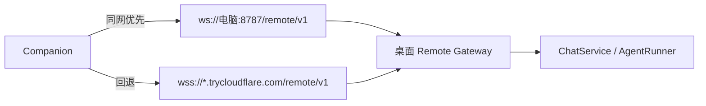

# Anya Companion

<p align="center"><strong>桌面 Anya 的安卓远程控制台。</strong></p>

<p align="center">
  扫电脑上的二维码，即可在手机上对话、审批工具、收发文件。<br />
  Agent 仍在桌面运行——本应用是遥控台，不是第二套运行时。
</p>

<p align="center">
  <a href="./README.md">English</a>
  &nbsp;·&nbsp;
  <a href="./README.zh-CN.md">简体中文</a>
</p>

<p align="center">
  
  
  
</p>

<p align="center">
  桌面端：<a href="https://github.com/rururunu/Anya">rururunu/Anya</a>
  &nbsp;·&nbsp;
  本仓库：<a href="https://github.com/rururunu/AnyaAndroid">rururunu/AnyaAndroid</a>
</p>

---

## 一览

|              |                                                                                          |
| ------------ | ---------------------------------------------------------------------------------------- |
| **配对**     | 扫描桌面「连接手机」二维码，或手动填写主机 / 令牌。深度链接：`anya://pair`。             |
| **对话**     | 与电脑同一批会话：发送、流式回复、取消，切换 Ask / Agent / Plan。                        |
| **审批**     | 工具允许一次 / 本会话 / 拒绝，以及 `ask_user` 与计划批准卡。                             |
| **文件**     | 手机附件分片上传（上限 500MB）；点桌面分享卡片分片下载。                                 |
| **可达性**   | 同一 Wi-Fi 走局域网 `ws://`；外出走 Cloudflare 隧道 `wss://`。                           |

**文档：** [架构](./docs/ARCHITECTURE.zh-CN.md) · [发布](./docs/release.zh-CN.md) · [更新日志](./CHANGELOG.zh-CN.md) · [索引](./docs/README.zh-CN.md)

桌面必须已开启 Remote Gateway。Companion **不会**自己去调模型服务商。

---

## 配对与连接

1. 在 Windows 上安装并打开 [Anya](https://github.com/rururunu/Anya)。
2. 打开 **连接手机**，等到二维码出现局域网地址（若已开启公网隧道，还会有公网主机名）。
3. 手机扫码（或填写主机 / 端口 / 令牌）。
4. `hello.ok` 之后，对话、审批与工作区卡片与桌面保持同步。

握手超过五秒，启动页会出现 **取消连接**，进入连接设置——可重连，或解除配对后重新扫码。Quick Tunnel 域名在桌面重启后会变；公网地址失效时请重新扫码。



---

## 能做什么

| 界面         | 用途                                                             |
| ------------ | ---------------------------------------------------------------- |
| **Ask**      | 不绑定工作区的快速提问。                                         |
| **工作区**   | 项目会话、文件目录、Skills / MCP 列表。                          |
| **收件**     | 待处理的工具审批与提问。                                         |
| **设置**     | 连接状态、重连 / 解除配对、语言、应用内更新。                    |

手机文件落到工作区 `.anya/uploads/{sessionId}/`（随问则进 Ask 收件箱）。桌面 `share_to_companion` 只发卡片，点按后按 512KB 分片拉取，避免一条巨大 Base64 打爆手机。本地网页预览走同一网关上的 `/p/{id}/`。

---

## 安装

1. 按下方构建 debug APK，或在本仓库 Releases 发布后安装正式包。
2. 按上文与正在运行的桌面 Anya 配对。
3. 尽量与电脑同一 Wi-Fi——比 Quick Tunnel 稳定，国内尤其如此。

最低 **Android 8.0（API 26）**。相机可选（仍可手动填写配对）。

---

## 从源码运行

推荐用 **Android Studio** 打开本目录，或：

```bat
gradlew.bat :app:assembleDebug
```

在 `local.properties` 中设置 `sdk.dir`（可参考 `local.properties.example`）。Debug 包名为 `ai.anya.companion.debug`。

| 工具链                            | 版本           |
| --------------------------------- | -------------- |
| AGP / Gradle / Kotlin             | 9.0 / 9.1 / 2.2 |
| compileSdk / minSdk / targetSdk   | 36 / 26 / 36   |
| Android 编译 JDK                  | 17             |

宿主编译若用 **Java 25**，需要 **Gradle ≥ 9.1**（已配置）。

---

## 技术架构（摘要）

```text
app → feature:* → domain ← data
                 ↘ model / common / designsystem
data → network → OkHttp WebSocket → 桌面 /remote/v1
```

Agent、工具、SQLite 与模型密钥都在电脑上。Companion 投影 `event` 帧（对话增量、审批、文件卡片），并发送 RPC（`chat.send`、`approval.respond`、`file.upload.*` 等）。

完整视图：[技术架构](./docs/ARCHITECTURE.zh-CN.md)。

---

## 隐私

配对凭证存在本机 DataStore。对话与文件只发往已配对桌面（局域网或你的 Cloudflare 隧道）。Companion 不保存模型 API Key。
