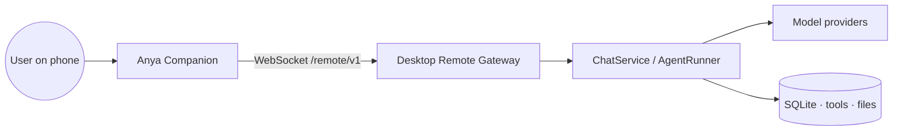
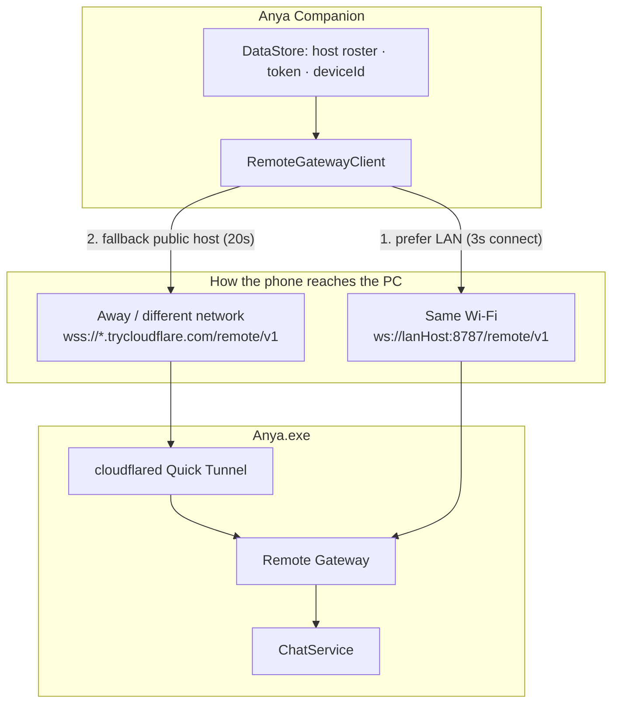
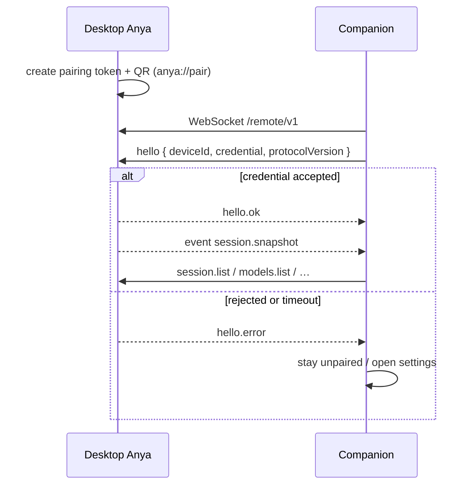
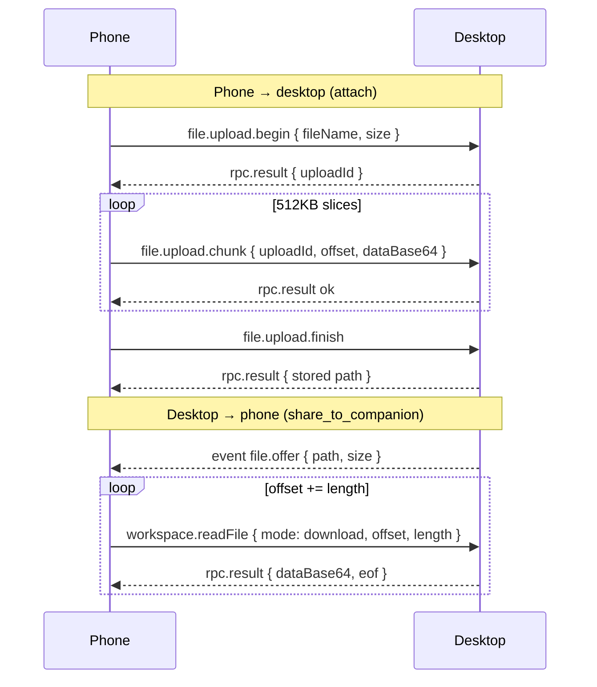

# Anya Companion — Architecture

This document describes how the Android remote console is structured, how it
talks to desktop Anya, and where to look when changing pairing, chat, files, or
reconnects.

<p>
  <a href="./ARCHITECTURE.md">English</a> ·
  <a href="./ARCHITECTURE.zh-CN.md">简体中文</a>
</p>

|               |                                                                              |
| ------------- | ---------------------------------------------------------------------------- |
| **Product**   | Anya Companion — remote console for [desktop Anya](https://github.com/rururunu/Anya) |
| **Repo**      | [rururunu/AnyaAndroid](https://github.com/rururunu/AnyaAndroid)              |
| **Version**   | v0.1.1                                                                       |
| **Runtime**   | Android 8.0+ (minSdk 26, compile/target 36)                                  |
| **UI**        | Jetpack Compose · Hilt · Navigation                                          |
| **Transport** | OkHttp WebSocket → desktop `/remote/v1`                                      |

**Related:** [Docs index](./README.md) · [Desktop architecture](https://github.com/rururunu/Anya/blob/main/docs/architecture-overview.md)

---

## 1. Scope

**In scope**

- Product role (remote console, not a second Agent)
- Gradle module map and dependency rules
- Pairing, LAN vs Cloudflare Tunnel, hello handshake
- Wire protocol (RPC + `event` frames)
- Chunked file upload / download
- Reconnect and boot-cancel behavior

**Out of scope**

- Desktop `AgentRunner` internals (see desktop architecture)
- Individual Compose visual tokens
- Cloudflare account / tunnel operator details

---

## 2. Product role

Companion is a **projection + RPC client**. Desktop Anya owns Agent runtime,
tools, SQLite, model keys, and approvals. The phone never calls model providers.



If the desktop is not running, Companion can only show pairing / connection
settings. It cannot complete a chat on its own.

### Surfaces

Each phone screen is a projection of desktop state, plus RPCs that unstick the
PC. There is one Agent, one approval latch, two screens.

| Surface | Desktop owns | Phone sends / receives |
| ------- | ------------ | ---------------------- |
| **Ask** | Unbound sessions in ChatService / SQLite | `session.list` + snapshot events. **+** creates a session on the PC. A **Pending approval** badge means AgentRunner is already blocked. |
| **Workspace** | Project folders on disk | Same sessions, grouped by workspace. Catalog via `workspace.snapshot` / `workspace.files` / `skills.list` / `mcp.list`. |
| **Chat** | AgentRunner, tools, model keys | `chat.send` / `chat.cancel` / `session.compose.*`. Tokens arrive as `event` deltas — the typing is the computer generating. |
| **ask_user** | Pauses the in-flight run | Same card on both screens. `ask.respond` resumes AgentRunner. |
| **Tool approval** | Gate in AgentRunner | Allow once / session / deny via `approval.respond`. Tapping the card on Windows hits the same latch. |
| **Inbox → Pending** | The same blocked tools / questions | Open the card → jump to that session → same `approval.respond` / `ask.respond`. |
| **Inbox → Results** | Files still on disk (`share_to_companion`) | Offer `event`; bytes pulled with `workspace.readFile` slices. Phone attach: `file.upload.*` → `.anya/uploads/{sessionId}/` (or the Ask inbox). |

Product walkthrough with screenshots: [../README.md](../README.md).

---

## 3. Module map

```text
:app
  → :feature:{pairing,sessions,chat,approval,workspace,settings}
  → :core:data → :core:network
  → :core:domain ← :core:data
  → :core:model / :core:common / :core:designsystem
```

| Module                  | Type              | Responsibility                                      |
| ----------------------- | ----------------- | --------------------------------------------------- |
| `:app`                  | application       | Hilt app, `AnyaNavHost`, boot / keep-alive wiring   |
| `:feature:pairing`      | android + compose | QR / manual / `anya://pair`                         |
| `:feature:sessions`     | android + compose | Ask + workspace session lists                       |
| `:feature:chat`         | android + compose | Composer, stream, attachments, share cards          |
| `:feature:approval`     | android + compose | Tool / ask_user / plan cards, Inbox pending / results |
| `:feature:workspace`    | android + compose | File catalog, skills / MCP lists                    |
| `:feature:settings`     | android + compose | Connection, language, in-app updates                |
| `:core:domain`          | jvm               | Repository contracts + use cases                    |
| `:core:model`           | jvm               | Wire + UI models                                    |
| `:core:common`          | jvm               | `AnyaResult`, dispatcher qualifiers                 |
| `:core:network`         | android           | `RemoteGatewayClient` (OkHttp WS)                   |
| `:core:data`            | android           | Repositories + DataStore credentials                |
| `:core:designsystem`    | android + compose | Theme / shared atoms                                |
| `build-logic`           | included build    | Convention plugins                                  |

### Dependency rules

1. `feature` → `domain` / `model` / `designsystem` / `common` only
2. `data` implements `domain` and uses `network`
3. `app` depends on all features + `data` (pulls Hilt modules onto the classpath)
4. No feature → feature dependencies
5. No UI types in `domain` / `model`

```text
UI (feature) → UseCase → Repository (domain)
                         ↑
                    data impl → RemoteGatewayClient → Desktop Anya
```

Convention plugins: `anya.android.application`, `anya.android.library`,
`anya.android.feature`, `anya.jvm.library`.

---

## 4. Reachability

Default gateway port is **8787**. Path is always `/remote/v1`.



| Path        | URL shape                                      | When                                              |
| ----------- | ---------------------------------------------- | ------------------------------------------------- |
| LAN         | `ws://{lanHost}:8787/remote/v1`                | Phone and PC on the same Wi-Fi                    |
| Public      | `wss://{trycloudflare host}/remote/v1`         | Different network; desktop tunnel enabled         |

OkHttp is locked to **HTTP/1.1** for this socket (`retryOnConnectionFailure(false)`).
Quick Tunnel over HTTP/2 was a common hang in China; HTTP/1.1 plus a LAN-first
dial is the supported path.

Boot handshake: if `hello.ok` never arrives, Companion does **not** retry
forever. After **5 seconds** the boot screen offers **Cancel connection**, which
calls `abandonUnreachableBoot()` and opens connection settings.

Quick Tunnel hostnames change when the desktop process restarts. Re-scan the QR
if the public URL went stale.

---

## 5. Pairing and hello



Deep link: `anya://pair?…` (host, port, token, optional public host). After the
first successful hello, the phone stores a device credential in a DataStore
**roster** (multiple desktops). Later launches reuse the active host until the
user unpairs it.

Each host can have a display name of at most 16 characters (the top-bar “Anya”
label becomes that name). Switch from the host list in Settings, or by
long-pressing the top-left logo. If the desktop rotates its tunnel hostname or
pairing token, **re-pair** that host: the local name and `deviceId` stay, only
the connection fields update.

Keep-alive: the server sends an application `ping`; the client replies `pong`.
Native WebSocket pings are not relied on (proxies often drop them).

---

## 6. Wire protocol

JSON frames, tagged `type`. Protocol version **1**.

| Direction        | Shape                                                                 |
| ---------------- | --------------------------------------------------------------------- |
| Phone → desktop  | RPC (`requestId`) or `hello` / `pong`                                 |
| Desktop → phone  | `hello.ok` / `hello.error`, `rpc.result`, `event { name, data }`, `ping` |

### RPCs (phone → desktop)

| `type`                   | Role                                              |
| ------------------------ | ------------------------------------------------- |
| `session.list`           | Session catalog                                   |
| `session.history`        | Load one thread                                   |
| `session.delete`         | Delete a session                                  |
| `chat.send`              | Send user text (+ mode / model / workspace)       |
| `chat.cancel`            | Cancel an in-flight run                           |
| `session.compose.get/set`| Ask / Agent / Plan + model on that session        |
| `models.list`            | Models configured on the desktop                  |
| `plan.approve`           | Approve a Plan gate                               |
| `approval.respond`       | Tool allow-once / session / deny                  |
| `ask.respond`            | Answer `ask_user`                                 |
| `workspace.snapshot`     | Workspace card for a session                      |
| `workspace.files`        | File catalog                                      |
| `workspace.readFile`     | Text peek, or `mode=download` one byte slice      |
| `skills.list` / `mcp.list` | Desktop skills / MCP servers                    |
| `file.upload.begin/chunk/finish/abort` | Phone → desktop attachment             |

### Events (desktop → phone)

Streamed as `event` frames: chat deltas, approvals, compose changes, file-share
offers, session snapshot, connection status. The phone **projects** them into
Compose state; it does not re-run the Agent.

Desktop implementation: `src-tauri/src/core/remote/` in
[rururunu/Anya](https://github.com/rururunu/Anya).

---

## 7. File transfer

Limit **500MB** per file. Slice size **512KB**. Per-slice timeout **60s**.



Phone attachments land under the workspace `.anya/uploads/{sessionId}/` (or the
Ask inbox). `share_to_companion` only pushes a card; bytes are pulled with
`workspace.readFile` so a single huge Base64 frame cannot blow up the phone.

Preview of local web apps uses HTTP `/p/{id}/` on the same gateway (reverse
proxy), not the WebSocket.

---

## 8. Runtime notes

| Topic              | Behavior                                                                 |
| ------------------ | ------------------------------------------------------------------------ |
| Keep-alive         | Foreground service while connected                                       |
| In-app update      | Foreground download + APK verify (size / optional sha256 / package / sig) |
| Package id         | `ai.anya.companion` (debug: `.debug`)                                    |
| Camera             | Optional; manual host/token still works                                  |

---

## 9. Related source

| Concern                         | Start here                                              |
| ------------------------------- | ------------------------------------------------------- |
| Nav / boot cancel               | `app/.../navigation/AnyaNavHost.kt`                     |
| Connection + abandon boot       | `core/data` connection repository                       |
| WebSocket client                | `core/network` `RemoteGatewayClient`                    |
| Pairing QR / deep link          | `feature/pairing`                                       |
| Ask / Workspace session lists   | `feature/sessions`                                      |
| Chat stream + attachments       | `feature/chat`                                          |
| Approvals + Inbox               | `feature/approval`                                      |
| Workspace catalog / skills      | `feature/workspace`                                     |
| Desktop gateway (other repo)    | `src-tauri/src/core/remote/` in Anya                    |
