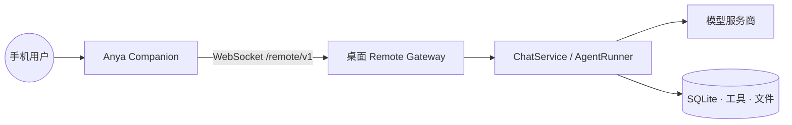
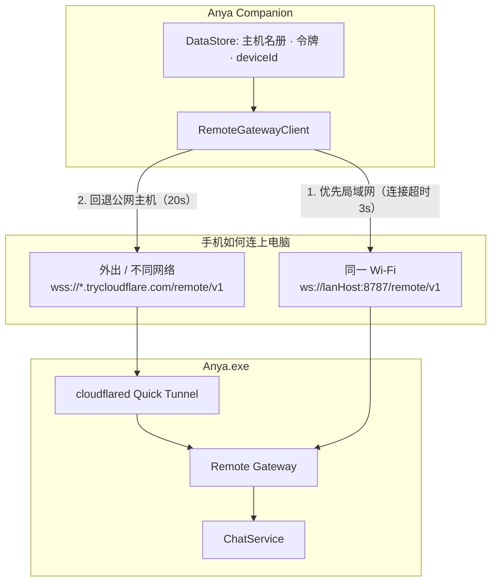
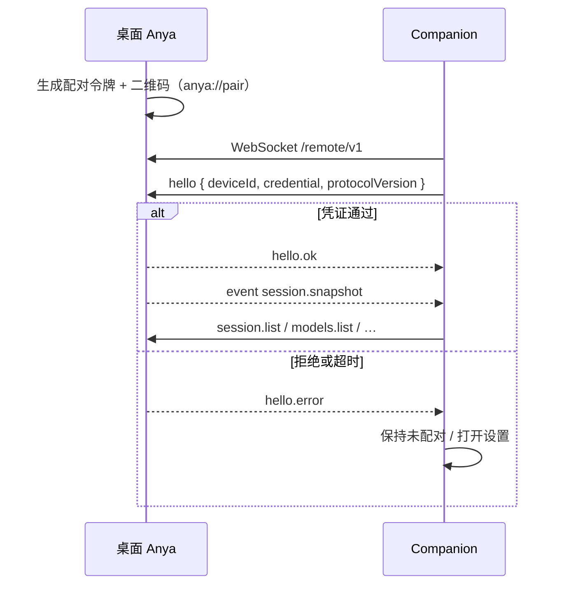
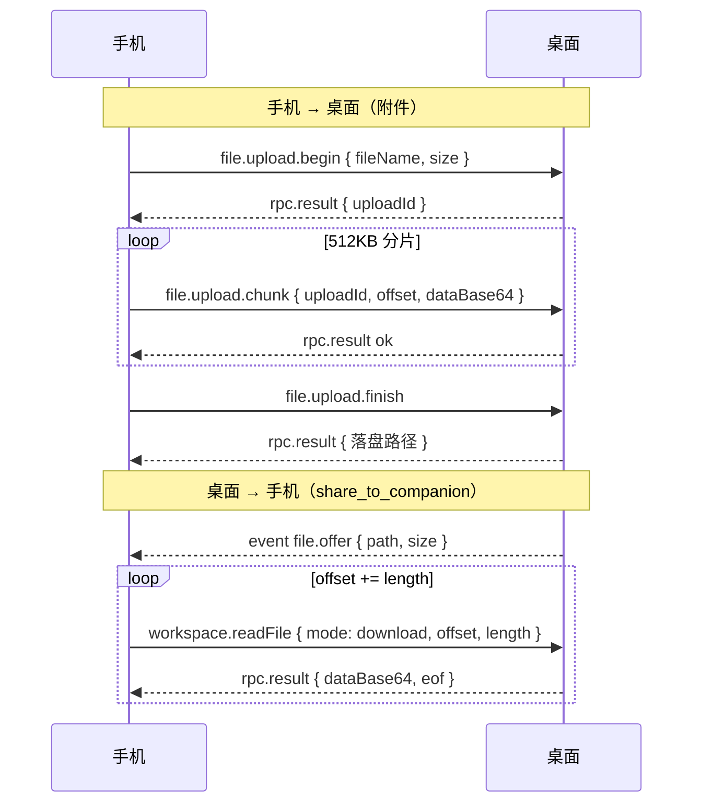

# Anya Companion — 技术架构

本文说明安卓远程控制台如何分层、如何连上桌面 Anya，以及改配对、对话、文件或重连时应从哪里下手。

<p>
  <a href="./ARCHITECTURE.md">English</a> ·
  <a href="./ARCHITECTURE.zh-CN.md">简体中文</a>
</p>

|            |                                                                              |
| ---------- | ---------------------------------------------------------------------------- |
| **产品**   | Anya Companion — [桌面 Anya](https://github.com/rururunu/Anya) 的远程控制台 |
| **仓库**   | [rururunu/AnyaAndroid](https://github.com/rururunu/AnyaAndroid)              |
| **版本**   | v0.1.1                                                                       |
| **运行时** | Android 8.0+（minSdk 26，compile/target 36）                                 |
| **界面**   | Jetpack Compose · Hilt · Navigation                                          |
| **传输**   | OkHttp WebSocket → 桌面 `/remote/v1`                                         |

**相关：** [文档索引](./README.zh-CN.md) · [桌面架构](https://github.com/rururunu/Anya/blob/main/docs/architecture-overview.zh-CN.md)

---

## 1. 范围

**范围内**

- 产品角色（远程控制台，不是第二套 Agent）
- Gradle 模块地图与依赖方向
- 配对、局域网 vs Cloudflare 隧道、hello 握手
- 线路协议（RPC + `event` 帧）
- 分片上传 / 下载
- 重连与启动页取消连接

**范围外**

- 桌面 `AgentRunner` 内部（见桌面架构文档）
- Compose 视觉 token
- Cloudflare 账号与隧道运维细节

---

## 2. 产品角色

Companion 是 **投影 + RPC 客户端**。Agent 运行时、工具、SQLite、模型密钥与审批都在桌面 Anya。手机**不会**自己去调模型服务商。



桌面未运行时，Companion 只能进入配对 / 连接设置，无法独立完成对话。

### 界面如何驱动桌面

手机每个界面都是桌面状态的投影，外加把电脑解冻的 RPC。Agent 只有一份，审批闸门只有一道，屏幕有两块。

| 界面 | 桌面持有 | 手机收发 |
| ---- | -------- | -------- |
| **随问** | ChatService / SQLite 里不绑项目的会话 | `session.list` + 快照事件。**+** 会在电脑上新建会话。黄标 **待审批** 表示 AgentRunner 已经停住。 |
| **工作区** | 磁盘上的项目文件夹 | 同一批会话按工作区分组。目录来自 `workspace.snapshot` / `workspace.files` / `skills.list` / `mcp.list`。 |
| **对话** | AgentRunner、工具、模型密钥 | `chat.send` / `chat.cancel` / `session.compose.*`。字是 `event` 增量推回来的——生成发生在电脑上。 |
| **ask_user** | 暂停正在进行的 run | 两边同一张卡。`ask.respond` 之后 AgentRunner 才继续。 |
| **工具审批** | AgentRunner 里的闸门 | 允许一次 / 本会话 / 拒绝，走 `approval.respond`。在 Windows 上点同一张卡是同一道闸。 |
| **收件 → 待确认** | 同一批被卡住的工具 / 提问 | 点卡片跳回该会话，仍是 `approval.respond` / `ask.respond`。 |
| **收件 → 结果** | 文件仍在电脑磁盘（`share_to_companion`） | 先推 offer `event`，字节用 `workspace.readFile` 分片拉。手机附件：`file.upload.*` → `.anya/uploads/{sessionId}/`（随问则进 Ask 收件箱）。 |

带截图的产品走查：[../README.zh-CN.md](../README.zh-CN.md)。

---

## 3. 模块地图

```text
:app
  → :feature:{pairing,sessions,chat,approval,workspace,settings}
  → :core:data → :core:network
  → :core:domain ← :core:data
  → :core:model / :core:common / :core:designsystem
```

| 模块                     | 类型              | 职责                                            |
| ------------------------ | ----------------- | ----------------------------------------------- |
| `:app`                   | application       | Hilt 应用、`AnyaNavHost`、启动 / 保活           |
| `:feature:pairing`       | android + compose | 扫码 / 手动 / `anya://pair`                     |
| `:feature:sessions`      | android + compose | Ask 与工作区会话列表                            |
| `:feature:chat`          | android + compose | 输入栏、流式、附件、分享卡片                    |
| `:feature:approval`      | android + compose | 工具 / ask_user / 计划卡，收件待确认 / 结果     |
| `:feature:workspace`     | android + compose | 文件目录、Skills / MCP 列表                     |
| `:feature:settings`      | android + compose | 连接、语言、应用内更新                          |
| `:core:domain`           | jvm               | Repository 契约与用例                           |
| `:core:model`            | jvm               | 线路与 UI 模型                                  |
| `:core:common`           | jvm               | `AnyaResult`、调度器 qualifier                  |
| `:core:network`          | android           | `RemoteGatewayClient`（OkHttp WS）              |
| `:core:data`             | android           | Repository 实现 + DataStore 凭证                |
| `:core:designsystem`     | android + compose | 主题与共用原子                                  |
| `build-logic`            | included build    | 约定插件                                        |

### 依赖规则

1. `feature` 只依赖 `domain` / `model` / `designsystem` / `common`
2. `data` 实现 `domain`，并使用 `network`
3. `app` 依赖全部 feature + `data`（把 Hilt 模块拉进 classpath）
4. feature 之间不得互相依赖
5. `domain` / `model` 不得出现 UI 类型

```text
UI (feature) → UseCase → Repository (domain)
                         ↑
                    data impl → RemoteGatewayClient → 桌面 Anya
```

约定插件：`anya.android.application`、`anya.android.library`、`anya.android.feature`、`anya.jvm.library`。

---

## 4. 可达性

默认网关端口 **8787**，路径始终是 `/remote/v1`。



| 路径   | URL 形态                                       | 何时使用                         |
| ------ | ---------------------------------------------- | -------------------------------- |
| 局域网 | `ws://{lanHost}:8787/remote/v1`                | 手机与电脑同一 Wi-Fi             |
| 公网   | `wss://{trycloudflare 主机}/remote/v1`         | 不同网络，且桌面已开隧道         |

该套接字锁定 **HTTP/1.1**（`retryOnConnectionFailure(false)`）。Quick Tunnel 走 HTTP/2 在国内容易卡住；HTTP/1.1 + 局域网优先是支持路径。

启动握手：若始终收不到 `hello.ok`，Companion **不会**无限重连。超过 **5 秒**启动页出现 **取消连接**，调用 `abandonUnreachableBoot()` 并进入连接设置。

Quick Tunnel 域名在桌面进程重启后会变；公网地址失效时请重新扫码。

---

## 5. 配对与 hello



深度链接：`anya://pair?…`（主机、端口、令牌、可选公网主机）。首次 `hello` 成功后，手机把设备凭证写入 DataStore **设备名册**（可保存多台主机），之后启动复用当前主机，直到用户解除配对。

用户可为每台主机设定不超过 16 字的显示名（顶栏「Anya」会换成该名称）。设置里的主机列表、或长按左上角 logo 可切换。桌面更新了隧道域名 / 令牌时，对该主机 **重新配对** 会保留显示名与 deviceId，只更新连接信息。

保活：服务端发应用层 `ping`，客户端回 `pong`。不依赖原生 WebSocket ping（代理常会丢掉）。

---

## 6. 线路协议

JSON 帧，用 `type` 区分。协议版本 **1**。

| 方向           | 形态                                                                      |
| -------------- | ------------------------------------------------------------------------- |
| 手机 → 桌面    | RPC（带 `requestId`）或 `hello` / `pong`                                  |
| 桌面 → 手机    | `hello.ok` / `hello.error`、`rpc.result`、`event { name, data }`、`ping` |

### RPC（手机 → 桌面）

| `type`                   | 作用                                              |
| ------------------------ | ------------------------------------------------- |
| `session.list`           | 会话目录                                          |
| `session.history`        | 加载一条线程                                      |
| `session.delete`         | 删除会话                                          |
| `chat.send`              | 发送用户文本（含模式 / 模型 / 工作区）            |
| `chat.cancel`            | 取消进行中的 run                                  |
| `session.compose.get/set`| 该会话的 Ask / Agent / Plan 与模型                |
| `models.list`            | 桌面已配置的模型                                  |
| `plan.approve`           | 批准 Plan 门禁                                    |
| `approval.respond`       | 工具允许一次 / 本会话 / 拒绝                      |
| `ask.respond`            | 回答 `ask_user`                                   |
| `workspace.snapshot`     | 会话工作区卡片                                    |
| `workspace.files`        | 文件目录                                          |
| `workspace.readFile`     | 文本预览，或 `mode=download` 拉一片字节           |
| `skills.list` / `mcp.list` | 桌面 Skills / MCP                               |
| `file.upload.begin/chunk/finish/abort` | 手机 → 桌面附件                         |

### 事件（桌面 → 手机）

以 `event` 帧推送：对话增量、审批、compose 变更、文件分享卡片、会话快照、连接状态。手机只做 **投影**，不重跑 Agent。

桌面实现：[rururunu/Anya](https://github.com/rururunu/Anya) 的 `src-tauri/src/core/remote/`。

---

## 7. 文件传输

单文件上限 **500MB**，分片 **512KB**，每片超时 **60s**。



手机附件落到工作区 `.anya/uploads/{sessionId}/`（随问则进 Ask 收件箱）。`share_to_companion` 只推卡片，字节用 `workspace.readFile` 拉取，避免一条巨大 Base64 打爆手机。

本地网页预览走同一网关上的 HTTP `/p/{id}/`（反向代理），不走 WebSocket。

---

## 8. 运行时备忘

| 主题         | 行为                                                                      |
| ------------ | ------------------------------------------------------------------------- |
| 保活         | 已连接时使用前台服务                                                      |
| 应用内更新   | 前台下载 + APK 校验（体积 / 可选 sha256 / 包名 / 签名）                   |
| 包名         | `ai.anya.companion`（debug：`.debug`）                                    |
| 相机         | 可选；仍可手动填写主机 / 令牌                                             |

---

## 9. 相关源码入口

| 关注点                       | 从这里开始                                          |
| ---------------------------- | --------------------------------------------------- |
| 导航 / 启动取消连接          | `app/.../navigation/AnyaNavHost.kt`                 |
| 连接与放弃启动握手           | `core/data` connection repository                   |
| WebSocket 客户端             | `core/network` `RemoteGatewayClient`                |
| 配对扫码 / 深度链接          | `feature/pairing`                                   |
| 随问 / 工作区会话列表        | `feature/sessions`                                  |
| 对话流式与附件               | `feature/chat`                                      |
| 审批与收件                   | `feature/approval`                                  |
| 工作区目录 / Skills          | `feature/workspace`                                 |
| 桌面网关（另一仓库）         | Anya 的 `src-tauri/src/core/remote/`                |
