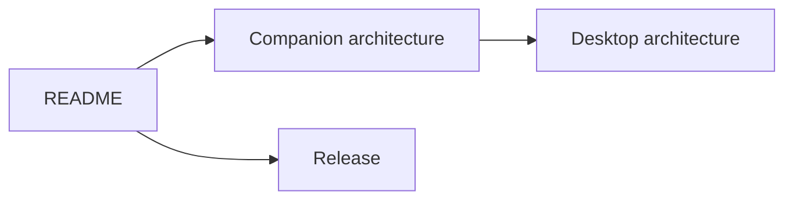

# Anya Companion documentation

  <a href="./README.md">English</a>
  &nbsp;·&nbsp;
  <a href="./README.zh-CN.md">简体中文</a>

Product home: [../README.md](../README.md)

Desktop Anya (Agent runtime): [github.com/rururunu/Anya](https://github.com/rururunu/Anya)

| Document                                  | Audience     | When to open it                                              |
| ----------------------------------------- | ------------ | ------------------------------------------------------------ |
| [Architecture](./ARCHITECTURE.md)         | Contributors | Modules, phone ↔ desktop surfaces, LAN / tunnel, protocol    |
| [Releases & in-app updates](./release.md) | Release      | `latest.json`, APK name, cut-a-release checklist             |
| [Changelog](../CHANGELOG.md)              | Users        | What shipped in each tag                                     |
| Desktop [architecture overview](https://github.com/rururunu/Anya/blob/main/docs/architecture-overview.md) | Both repos | Where the gateway lives inside Anya.exe                      |

When behavior changes, update the matching document and keep its Chinese twin (`*.zh-CN.md`) in sync.
