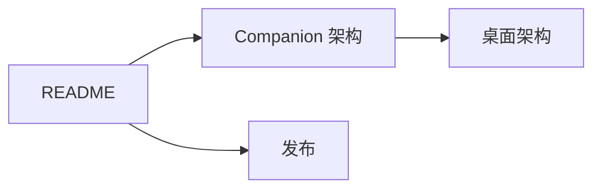

# Anya Companion 文档索引

  <a href="./README.md">English</a>
  &nbsp;·&nbsp;
  <a href="./README.zh-CN.md">简体中文</a>

产品主页：[../README.zh-CN.md](../README.zh-CN.md)

桌面 Anya（Agent 运行时）：[github.com/rururunu/Anya](https://github.com/rururunu/Anya)

| 文档                                        | 读者     | 适用场景                                           |
| ------------------------------------------- | -------- | -------------------------------------------------- |
| [技术架构](./ARCHITECTURE.zh-CN.md)         | 贡献者   | 模块、手机 ↔ 桌面界面、局域网 / 隧道、协议         |
| [发布与应用内更新](./release.zh-CN.md)      | 发版     | `latest.json`、APK 文件名、发版清单                |
| [更新日志](../CHANGELOG.zh-CN.md)           | 用户     | 各 tag 发了什么                                    |
| 桌面 [技术架构总览](https://github.com/rururunu/Anya/blob/main/docs/architecture-overview.zh-CN.md) | 两端 | 网关在 Anya.exe 里的位置                           |

行为变更时，请更新对应文档，并保持中英文姊妹篇（`*.zh-CN.md`）结构同步。
